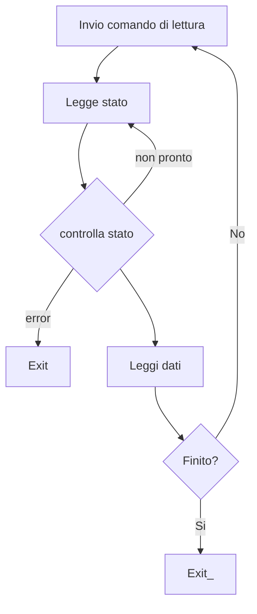
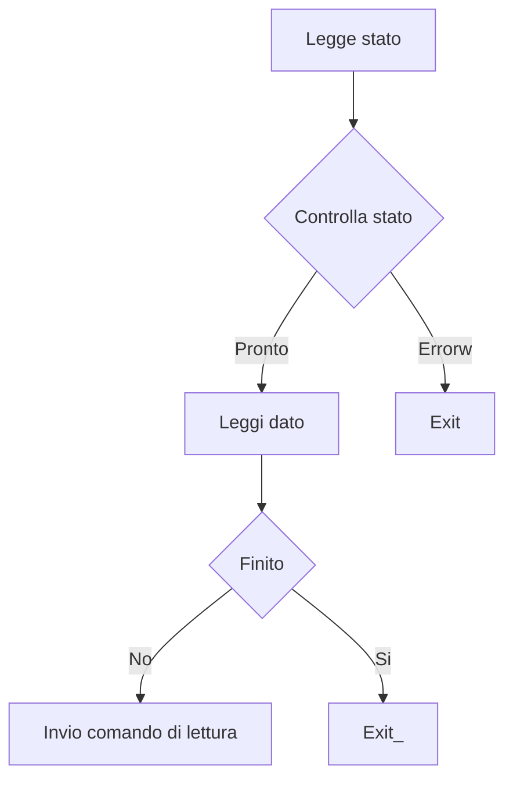

Sistemi di **I/O** usati per collegare il calcolatore a dispositivi esterni

## Bus

I vari sottosistemi di un calcolatore comunicano attraverso interfacce predefinite 
Collegamento eseguito attraverso un **bus** che implementa un canale di comunicazione condiviso da più sottosistemi

Example :

![[Immagine 2023-05-02 150420.png]]

Vantaggi :
+ _Versatilità_ : facile aggiungere o togliere dispositivi , le periferiche possono essere spostate tra sistemi differenti che usano lo stesso tipo di **bus** 
+ _Basso costo_ : Uno stesso collegamento è utilizzato per diverse esigenze
Svantaggi : 
+ _Collo di bottiglia_ : la banda del **bus** limita la massima frequenza di **I/O**

 Un **bus** è composto da un insieme di fili ( piste ) che veicolano segnali elettrici
 + Fili di **controllo** trasportano : 
	 + richieste di operazioni di **I/O**
	 + Acknowledge della richiesta
+ Fili per **dati** / **indirizzi** trasportano :
	+ Dati per effettuare la richiesta di operazione di **I/O** ( contenente es : indirizzo di memoria su cui scrivere )
	+ Dati per trasferire i risultati della richiesta di **I/O**

### Tipi di bus

Esempi di **bus** :
+ **System bus** : Interconnettono CPU e Memoria , caratteristiche :
	+ Corti
	+ Alta velocità
	+ Proprietari
+ **Backplane** : Interconnnettono dispositivi diversi con bande di trasferimento diverse , caratteristiche :
	+ Mediamente lunghi
	+ Veloci
	+ Standard ( es. PCI, PCIe )
+ **IO** : Bus standard come **SATA** per gestire catene di dischi , caratteristiche 
	+ Lunghi
	+ Lenti
	+ Standard

### Gerarchie di bus

Old system ( discontinued )

![[Immagine 2023-05-02 151852.png]]

**Bus** I/O interfacciati direttamente con il **bus** processore-memoria

![[Immagine 2023-05-02 152049.png]]

Sistema moderno che consente di ridurre i conflitti nell'accesso al **bus** in modo gerarchico

![[Immagine 2023-05-02 152220.png]]

### Esempi di **bus** Intel

#### Pre 2010

+ CPU connessa ad un chip chiamato _Northbridge_ attraverso il  _Front side bus_ 
+ _Northbridge_ controlla lo scambio dati tra CPU , memoria e interfacce veloci come schede grafiche
+ _Southbridge_ è un chip connesso a _Northbridge_ attraverso un bus proprietario ( Hub-link )
+ _Southbridge_ è responsabile di inerconnettere dispositivi più lenti attraverso il **bus** PCI , LPC ( Low Pin Count ) , USB , SATA

![[Immagine 2023-05-02 153249.png]]

#### PC moderni

+ _Northbridge_ integrato nella CPU 
+ _Southbridge_ diventa : I/O control HUB o Platform Controller HUB
+ Le schede grafiche sono direttamente connesse alla CPU tramite PCIe 3.0
+ _Southbridge_ connesso alla CPU trmite un **bus** chiamato **DMI ( Direct Media Interface )** basato sullo standard PCIe  

![[Immagine 2023-05-02 153347.png]]

## BUS Sincrono

Linea di clock condivisa tra gli elementi connessi al **bus** 
Il protocollo di conmnicazione sfrutta questo clock per arbitrare gli accessi al **bus**
+ Al ciclo X il dispositivo N pone sul **bus** una richiesta di lettura per M
+ Al ciclo X+d il dispositivo N può leggere i dati ( poste sulle linee dati del **bus** del dispositivo M )

Limitato a **bus** corti ( es: **bus** proprietari tra CPU - Memoria ) , con **bus** più lunghi si verifica il fenomeno del clock _skew_ ( disallineamento del segnale di clock )

## BUS Asincrono

Linea di clock non condiviso tra dispositivi connessi al **bus** ( ogni dispositivo ha il proprio ciclo di clock ) , permette la comunicazione tra periferiche di velocità diverse

**bus** standard : 
+ USB
+ SATA
+ PCIe

Protocollo di comunicazione per effettuare una trasazione di IO richiede una sincronizzazione iniziale ( **handshaking** ) che comporta dell'overhead

Oltre alle linee per il trasferimento di dati bisogna aggiungere 2 segnali per sincronizzare le operazioni ( **Req , Ack** )

Esempio :

1. All'inizio tutte le linee sono not-asserted ( volts to 0 )
   ![[Immagine 2023-05-04 125100.png]]
2. Il dispositivo A mette l'informazione da trasferire sulla linea dati e imposta **Req** a 1
   ![[Immagine 2023-05-04 130902.png]]
3. Il dispositivo B si accorge che **Req**=1 , legge quindi dalla linea **DATA** l'informazione presente. Quando l'informazione è stata letta imposta **Ack**=1
   ![[Immagine 2023-05-04 130957.png]]
4. Il dispositivo A si accorge che **Ack**=1 e sa quindi che la lettura è terminata , imposta **Req** e **DATA** a 0
   ![[Immagine 2023-05-04 131024.png]]
5. Il dispositivo B si accorge che **Req**=0 e imposta quindi **Ack** a 0
   ![[Immagine 2023-05-04 131044.png]]

## Arbitraggio

Se il bus è condiviso da più di due dispositivi si rende necessario un arbitraggio del **bus** per evitare conflitti 

Chi può iniziare una transazione sul **bus** è detto **master** del **bus**
I dispositivi che competono per l'uso del **bus** hanno linee aggiuntive che li collegano all'**arbitro** del **bus** , queste linee permettono di effettuare la richiesta , assegnazione e rilascio del **bus**

### Daisy Chain

Esempio :

I richiedenti sono posti in catena in funzione della loro priorità
![[Immagine 2023-05-04 131213.png]]

1. Quando un device deve trasmettere imposta a 1 la linea _request_ . La richiesta arriva all'**arbitro** che però non sa chi l'ha effettuata ( la linea _request_ è condivisa )
2. L'**arbitro** imposta quindi _grant_ a 1 che viene intercettato dal primo device nella catena 
3. Il device 1 può decidere se prendere lui il controllo del **bus** oppure propagare il segnale _grant_ al device sucessivo
4. Se viene propagato il device che ha fatto la richiesta riceve il segnale _grant_ e può iniziare a trasmettere
5. Al termine delle operazioni il segnale _release_ viene impostato a 1 e l'**arbitro** imposta a 0 il segnale _grant_

**Vantaggi**
+ _Semplice_ da implementare , richied pochi segnali di controllo
**Svantaggio**
+ _non è fair_ : Un dispositivo ad alta priorità può causare _starvation_ dei dispositivi a bassa priorità

### Altri tipi di arbitri

+ Centralizzato ma con linee multiple di richiesta / rilascio
+ Completamente distribuito ( es: Ethernet )

## Gestione IO

Un'operazione di **IO** è un trasferimeto dati che può avvenire 
+ Da un dispositivo alla memoria ( Input )
+ Dalla memoria al dispositivo ( Output )

Per effettuare questi trasferimenti occorre comunicare con il **controller** di ciascun dispositivo. Attraverso il controller è possibile dare comandi al dispositivo, leggere il suo stato e scrivere / leggere dati

### Controller

In genere un **controller** contiene dei registri tra cui :
+ **Command** register : utilizzato per inviare comandi al controller
+ **Status** register : utilizzato per conoscere cosa sta facendo il device o se è in stato di errore
+ **Data Write** register : utilizzato per il trasferimento di dati vero il device
+ **Data Read** register : utilizzato per trasferire dati dal device alla memoria

![[Immagine 2023-05-04 132825.png]]

#### Comunicare con il controller 

##### Memory mapped (IO)

+ I registri del dispositivo sono viste come locazioni di memoria speciali ( mappate in memoria )
+ La CPU legge e scrive quei registri attraverso normali load e store agli indirizzi di memoria mappati
+ **MMU** ( **Memory Managment Unit** ) indirizza le richieste di load e store al dispositivo anziche alla RAM

##### Istruzioni speciali

+ L'ISA della CPU comprende delle istruzioni speciali per leggere i registri di determinati **controller** ( discontinued )

#### Operazione di IO

+ Verificare lo stato del dispositivo
+ Dare dei comandi 
+ Scrivere / leggere i dati presenti nei registri dati

La CPU può essere o no coinvolta in queste operazioni a seconda della tecnica di **IO** che vogliamo utilizzare , la scelta di una tecnica dipende dalle caratteristiche del dispositivo

##### Polling ( Programmed IO )

Caratteristiche :
+ La CPU è sempre coinvolto in tutti i singoli trasferimenti
+ La CPU controlla periodicamente ( _sonda_ ) lo stato del dispositivo per determinare se ha bisogno di trasferire dei dati
+ Se vi sono dati disponibili , la CPU legge dal registro _data read_ i dati e li scrive nella RAM ( o in un registro della CPU ) per utilizzi futuri. 

_Il controllo del dispositivo è affidato interamente alla CPU_

**Vantaggi**
+ Utile nelle applicazioni real-time perchè l'overhead di controllo del dispositivo è maggiormente predicibile
+ Utile se la frequenza di trasferimento è molto alta, quindi il controllo del registro di sstato da spesso esito positivo 
**Svantaggi**
+ La CPU spreca molto tempo per verificare se ci sono dati disponibili , la maggior parte delle volte da esito negativo poichè la CPU è molto più veloce dei dispositivi di **IO**
+ La CPU spreca tempo per traferire dati dal dispositivo alla RAM

##### Interrupt-driven IO

Il dispositivo utilizza le interruzioni per segnalare alla CPU degli eventi , come la presenza di nuovi dati da leggere nel registro _data read_ 

La gestione delle interruzione viene gestita dalla CPU che salta ad un certo indirizzo di memoria contenente l'**interrupt handler** che : 
+ Salva lo stato del programma attualmente in esecuzione
+ Individua quale dispositivo ha generato l'iterruzione e ci comunica

**Vantaggi**
+ Utile se il dispositivo comunica raramente o ad intervalli temporali non predicibili , la CPU può eseguire altre operazioni nel mentre aspetta che il dispositivo diventi pronto
+ Non è necessario specificare la frequenza di **polling**
**Svantaggi**
+ L'overhead per la gestione dell'interruzione è più alto di quello del **polling** perchè la pipeline va svuotata , occorre salvare lo stato del processo attualmente in esecuzione etc..
+ Diventa dispendioso se il dispositivo comunica frequentemente

Negli esempi fino ad ora l'accesso alla memoria viene effettuato esclusivamente dalla CPU
**Vantaggi**
+ Hardware più semplice
**Svantaggi**
+ Rallentamento dell'esecuzione dei programmi se si devono trasferire molti dati

Soluzione :

#### Direct Memory Access ( DMA )

Il trasferimento dati tra dispositivo e memoria avviene grazie ad un controllore esterno alla CPU chiamato controller **DMA**

+ CPU si limita a fronire al **DMA** infromazioni su quanti dati leggere / scrivere e gli indirizzi coinvolti
+ Il trasferimento avviene senza l'intervento della CPU
+ Al termine del trasferimento la CPU viene notificata attraverso un interrupt

![[Immagine 2023-05-04 143623.png]]

