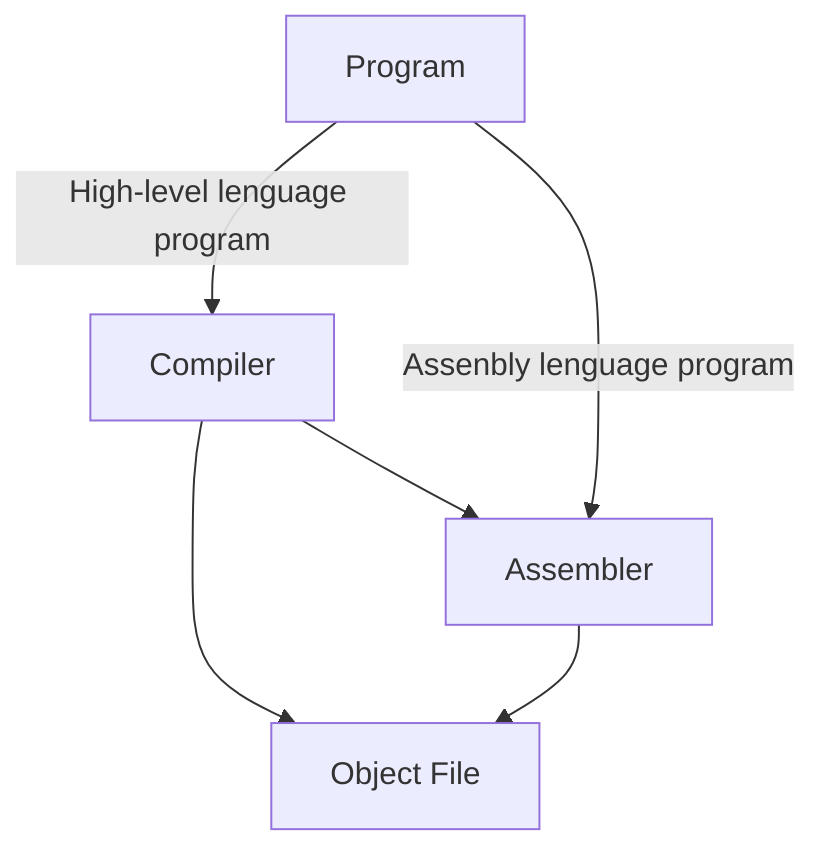
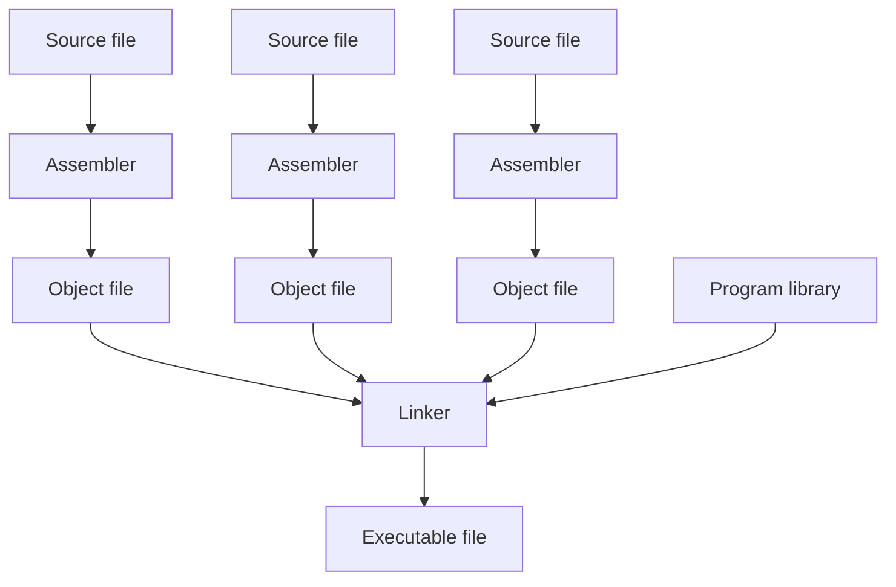

L'unico linguaggio che la CPU può eseguire è il linguaggio macchina

C'è bisogno di tradurre i linguaggi ad alto livello in linguaggio macchina 2 approcci 

+ **Interpretazione** : Un interprete per un certo programma "interpreta" linea per linea il linguaggio L ed esegue il codice macchina corrispondente
	+ Vantaggi
		+ Flessibilità del linguaggio, portabilità ( basta portare l'niterprete in un'alta macchina non serve ricompilare )
	+ Svantaggi
		+ Lentezza
		+ Legato alla presenza dell'niterprete nella macchina in cui viene eseguito
+ **Compilazione** : Utilizza un programma ( **compilatore** ) che prende in input un programma in linguaggio L e lo traduce in un programma in un altro linguaggio ( linguaggio macchina o un'altro linguaggio )
	+ **Assembler** :  Compilatore che traduce il linguaggio assembly in linguaggio macchina

## Processo di compilazione



## Object files 

Un object file è il risultato della compilazione e contiene **istruzioni** , **dati** e informazioni aggiuntive ( **metadati** ) necessari per produrre un programma eseguibile

Composizione Object file
+ **header** : descrive contenuto dell'object file
+ **text segment** : contiene il codice macchina prodotto dall'assemblatore
+ **data segment** : contiene i dati globali necessari per l'esecuzione del programma
+ **relocation information** : identifica le istruzioni e i dati che dipendono da indirizzi assoluti
+ **symbol table** : che contiene i simboli ( le label ) locali e globali ( da esportare )
+ **debug information** : Informazioni aggiuntive come ad esempio il mapping tra sorgente ad alto livello e codice macchina

Programmi con più codici sorgenti ( **moduli** ) compilati in modo indipendente in modo da diventare **object files** che contengono al loro interno riferimenti ad altri object files 

**Linker** combian diversi **object files** per produrre un file eseguibile

Nei sistemi **UNIX** i file oggetto e il file eseguibile hanno lo stesso formato ( **ELF** ) , il file eseguibile è un file oggetto con : 
+ tutti i riferimenti a funzioni esterne sono stati risolti
+ non vi sono informazioni di relocazione ( l'indirizzo di caricamento è noto )




**Assembler** :

+ Produce il codice macchina di ciascuno modulo assumendo venga eseguito a partire dall'indirizzo 0x00000
+ Tiene nota di tutte le istruzioni che si riferiscono ad indirizzi assoluti, queste andranno aggiornate quando è noto l'indrizzo in cui saranno caricate in fase di esecuzione
+ Tiene nota di tutte le funzioni ( labels ) che si desidera esportare in un certo modulo

**Linker** : 

+ Prende i **text segment** di ogni object file e li concatena in un unico segmento
+ Prende i **data segment** di ogni object file e li concatena in un unico segmento
+ Concatena i 2 segmenti generati 
+ Risolve i riferimenti sulla base della rilocazione dei vari segmenti
	+ La concatenazione dei **text/data segment** rispetto ad un indirizzo virtuale comporta la potenziale modifica degli indirizzi assoluti contenuti nelle istruzioni e nei dati
	+ Utilizza informazioni di rilocazione di ciascun object file per stabilire quali istruzioni aggiornare con i nuovi indirizzi assoluti

**Loader** ( esecuzione del programma da parte del sistema operativo ) : 

1. Legge l'header dell'eseguibile per determinare le dimensioni dei segmenti **text** e **data** 
2. Crea un nuovo spazio di indirizzamento per il programma ( grande abbastanza per contenere **test** e **data** segment e ulteriore memoria , **stack** e **heap** , necessaria durante l'esecuzione )
3. Copia i segmenti **data** e **text** nel nuovo spazio di indirizzamento
4. Copia i parametri passati da riga di comando nello **stack**
5. Inizializza i registri ( a 0 i general porpouse , inizializza lo **stack pointer SP** )
6. Salta all'indirizzo definito nell'entry-point specificato nell'header dell'eseguibile


## Little - Big endian

CPU **little-endian** mantengono i dati nei registri con i valori meno significativi nelle posizioni più significative

|0x100|0x101|0x102|0x103|
|---|---|---|---|
|67|45|23|01


CPU **big-endian** mantengono i dati nei registri normalmente

|0x100|0x101|0x102|0x103|
|---|---|---|---|
|01|23|45|67

## Direttive dell'assemblatore

Comandi da dare all'assemblatore durante la compilazone

Alcune di queste direttive permettono di riservare e inizializzare dello spazio utilizzabile per le variabili

_Example_

```arm-asm
.word 10 ,20 ,30
```

Alloca una sequenza di 3 numeri a 4 byte e ci scrive il valore 10 , 20 , 30

_Altre direttive_

```arm-asm
.float <num>    // inserisce un numero float32
.ascii <str>    // inserisce una stringa ( non terminata da zero )
.asciiz <str>   // inserisce una stringa terminata da zero
.byte <n>       // inserisce un byte
.word <n>       // inserisce un numero int32
.dword <n>      // inserisce un numero int64
.space <k>      // riserva k bytes non inizializzati
```


## Memoria in linguaggio macchina

Quando programmiamo in **assembly** non abbiamo direttamente il concetto di variabile

La memoria si distingue in :
+ **Interna** : registri della CPU
+ **Esterna** : la RAM

I registri sono un numero fisso mentre la memoria esterna è potenzialmente illimitata 

Le variabili in genere sono molte la scelta è quindi di metterle in memoria

In C viene permesso di definire il tipo associato ad una variabile ( int , float ) , in assembly occorre specificare la dimensione de ogni tipo di dato per allocarlo correttamente in memoria

Per usare delle variabili in linguaggio macchina occorre operare sugli indirizzi

_Esempio_ :

In C :
``` c
int a; int b; int c;
```

In assembly dobbiamo decidere dove mettere le variabili in memoria 

```arm-asm
a: 0x220184 ... 0x220187 
b: 0x220188 ... 0x22018B
c: 0x22018C ... 0x22018F
```

_Esempio_ : 

```c
int a; int b; intc; c=a+b;
```

```arm-asm
movz x0, #0x22, LSL #16   // 0x = 0x220000 l'address è maggiore di 16 bit
movk x0, #0x184           // 0x = 0x220184
ldr w1, [x0]              // w1 < mem[x0]
movk x0, #0x188           // x0 = 0x220188
ldr w2, [x0]              // w2 = mem[x0]
add w2, w1, w2            // w2 = w1 + w2
movk x0. #0x18c           // x0 = 0x22018c
str w2, [x0]              // w2 > mem[x0]
```

Non molto comodo operare direttamente sugli indirizzi poichè :
+ Non è sempre possibile conoscere esplicitamente l'indirizzo delle variabili o istruzioni
+ Si usano etichette ( **labels** ) associate a specifici punti del programma o dati
+ L'assemblatore può convertire le **labels** nel loro corrispettivo valore


Utilizziamo le **direttive dell'osservatore** per inizializzare le variabili , grazie all'istruzione **adr** non serve conoscere esplicitamente l'indirizzo che avranno le variabili in memoria a seguito del linking

```c
int a=10;
int b=20;
int c=0;
c=a+b;
```

```arm-asm
.text
adr x0, a       // x0 = &a
ldr w1, [x0]    // w1 < mem[x0]
adr x0, b       // x0 = &b
ldr w2, [x0]    // w2 < mem[x0]
add w2, w1, w2  // w2 = w1+w2
adr x0, c       // x0 = &c
str w2, [x0]    // w2 > mem[x0]

.data
a: .word 10
b: .word 20
c: .word 0
```

## Complex expression

```c
a = b + d + a*3 + (3/a - a/2 + a*a*3.14)
b = a*2
c = a + a*a + 1/(a-2)
```

2 approcci : 
+ **Approccio modulare** : traduciamo ogni accesso alla variabile con una **ldr** e ogni scrittura con una **str** 
	+ Poco efficiente
+ **Apptroccio ottimizato** : si minimalizza il numero di variabile mantenute nei registri e minimalizza gli accessi alla memoria / cache
	+ Il compilatore cerca di evitare di copiare dati ( varaibili ) da registri alla memoria a meno che non sia strettamente necessario
	+ Usare più registri possibili per memorizzare le variabili
	+ In C `register` suggerisce al compilatore di mantenere una variabile in un registro


## Principali costrutti

### `if`

In C

``` c
if (cond) {
	// ramo then
}else {
	// ramo else
}
```

In Assembly

```arm-asm
	b.<!cond> else-label
		// ramo then
	b exit-label
else-label : 
	// ramo else
exit-label : 
```

### `do while`

In C

```c
do {
	// corpo
} while ( cond )
```

In Assembly

```arm-asm
init-do :
	// corpo
	b.<cond> init-do
```


### `while`

In C

```c
while (cond){
	// corpo
}
```

In Assembly

```arm-asm
init-while :
	b.<!cond> exit-while
		// corpo while
	b init-while
exit-while :
```

Il blocco di istruzioni che definiscono il while contengono, oltre al corpo del while un salto condizionato e uno incondizionato

Costrutto ottimizato

```arm-asm
	b.<!cond> exit-while
init-while :
	// corpo while
	b.<cond> init-while
exit-while :
```

### `for`

In C

```c
for(<init>; <cond>; <incr>){
	// corpo for
}
```

Possiamo esprimerlo come un while

```c
<init>
while( cond ){
	// corpo for
	<incr>
}
```

In Assembly

```arm-asm
	<init>
	b.<!cond> exit-for
init-for :
	// corpo for
	<incr>
	b.<cond> init-for
exit-for :
```

### `Array`

Possiblità di dichiarare e allocare n variabili dello stesso tipo

`int A[10]; // alloca 10 interi`

è possibile accedervi attravero un index `x` , `A[x]`  

L'indirizzo di `A[x]` è `&A[0]+sizeof(int)*x`

Se `x0` contiene l'indirizzo di `A[0]` e `x1` contiene l'indice dell'array possiamo ottenere `x3 = &(A[x1])`   nel modo seguente : `add x3, x0, x1, LSL #2` 
`LSL #2` dipende in base ai tipi dell'array ( in questo caso un int bisogna moltiplicare per 4 )

Per offset noti in fasi compilazione è possibile utilizzare direttamente l'addressing mode offset :
`ldr w4, [x0, #12]  // x4 = A[3]` 

### Stinghe

Per gestire le stringhe dobbiamo caricare singoli byte ( per ogni carattere ) per questo ci sono le istruzioni 
+ `STRB w0, [<addr>]`  memorizza il byte meno significativo di w0 all'indirizzo [< addr >]
+ `LDRB w4, [<addr>]` carica il byte all'indirizzo [< addr >] nel byte meno significativo di w4 e padda il resto a 0

#### Codifica delle stringhe

##### ASCII ( American Standard Code for Information Interchange )

+ Ogni byte rappresenta un carattere
+ 128 caratteri possibili ( il bit più significativo viene sempre posto a 0 )
	+ 0 - 31 : caratteri di controllo come `(10)=\n` ( line feed ) , `(13)=\r` ( carriage return )
	+ 32 - 126 : caratteri stampabili
	+ 127 carattere di controllo ( DEL )

![[Immagine 2023-04-20 162924.png]]

I caratteri **alfabetici** e **numerici** corrispondono a codici _consecutivi_

_Aritmetica_

+ `char + 32` trasforma il carattere Maiuscolo in minuscolo
+ `char - 32` trasforma il carattere minuscolo in Maiuscolo
+ `number - 48` ricaviamo il "numero" rappresentato da un carattere numerico Esempio :  50 - 48 = 2 , 50 è la codifica del carattere 2 

In Assembly :

Caricare una stringa in memoria  :  "ciao" 
```arm-asm
.byte 67, 73, 65, 79, 0  // 0 fine stringa
.asciz <<ciao>>
```

**Limitaizioni** : **ASCII** codifica solo l'alfabeto inglese
sono necessarie altre codifiche.

##### ISO 8859-1 ( Latin-1 )

![[Immagine 2023-04-20 164039.png]]

##### ISO 8859-15 (Latin-9)

![[Immagine 2023-04-20 164124.png]]

Ci sono molte codifiche differenti, in generale non c'è modo di sapere quale applicare ad un qualsiasi testo scritto, se utilizziamo la codifica sbagliata rischiamo di vedere dei simboli differenti

Esempio :  Windows 1252 vs Mac OS Roman

![[Immagine 2023-04-20 164433.png]]

##### UNICODE

Set di caratteri universale contiente $1.114.112$ caratteri ( code points ) 
Per codificare tutti i simboli servirebbero 3 bytes per carattere questo incrementerebbe di 3 volte la dimensione di ogni testo

Soluzione : **multi-byte character encoding** 
Utilizziamo pochi bytes per i caratteri frequenti e molti bytes per caratteri poco frequenti ( **UTF-8** )

##### UTF-8

+ I primi 128 caratteri richiedono 1 byte e sono codificati come in **ASCII** 
+ I sucessivi 1920 caratteri richiedono 2 bytes ( coprono la maggior parte degli alfabeti )
+ 3 byte per i caratteri lingustici ( coprono le lingue asiatiche )
+ 4 byte per emoji, simboli matematici etc.

La decodifica di un carattere in **UTF-8** : 
+ Se un byte inizia con 0 allora quel carattere è rappresentato da un byte
+ Se un byte inizia con 1  allora devo contare quanti 1 si trovano successivamente fino ad uno 0 terminale , il numero di 1 corrisponde al numero di byte con il quale è rappresentato quel carattere

![[Immagine 2023-04-20 165405.png]]

### Procedure e Funzioni

Le procedure / funzioni porzioni di programmi che possono essere richiamate per eseguire un codice

Le funzioni restituiscono un valore, invece le procedure non restituiscono nulla `void`

Per chiamare una funzione abbiamo bisogno di interrompere il flusso di istruzioni e dare il controllo al codice della procedura stessa 
Al termine della procedura l'esecuzione deve riprendere all'istruzione sucessiva l'interruzione

+ Salvare il **PC**
+ Modificare il **PC** con l'indirizzo della funzione
+ Ripristinare il **PC** salvato +4 ( prossima istruzione ) al termine della procedura

_Chiamare una funzione_

```arm-asm
proc :
	// code
	RET

BL proc
```

**BL** salva **PC+4** nel registro **LR (x30)** e salta ( **B** ) all'indrizzo della procedura

**RET** e **BR  LR** sono concettualmente equivalenti ma conviene usare **RET** poichè : 
+ **RET** indica in modo esplicito che stiamo uscendo da una procedura / funzione
+ **RET** viene modellata in modo esplicito dal branch predictor, se usiamo **RET** per uscire da una funzione abbiamo più possibilità che il predictro effettui la scelta giusta

_Passaggio parametri e valore di ritorno_

è necessario un accordo tra chiamante e funzione chiamanta su dove mettere i parametri e il valore di ritorno , regole chiamate **Procedure Call Standard (PCS)**

**ARM (PCS)**

+ I parametri della funzione chiamata sono passati nei registri `x0, x1, ... , x7` , se la funzione accetta più di 8 parametri è necessario usare lo **Stack** ( `w0, w1` in caso di interi a 32 bit , `d0, d1` in caso di numeri floating point)
+ Il valore di ritorno di una funzione è passata nel registro `x0`
+ L'indirizzo della prossima istruzione del codice chiamante è contenuto in `x30` o **LR**

**Side Effects** : invocare una funzione può comportare modifiche ai valori dei registri

+ La funzione chiamata può utilizzare i registri `x0, x1 , ... , x15` senza preoccuparsi di preservarne il valore , è responsabilità del chiamante salvare il loro valore se necessario
+ La funzione chiamata deve preservare il valore dei registri `x19 , ... , x27` , possono essere modificati però prima di ritornare al chiamante ( **RET** ) deve essere ripristinato il loro valore originario
+ I registri `x8, x16, x17, x18` sono riservati 

_Dove salviamo i registri da preservare?_

1. Creare delle variabili per ciascuna funzione in cui salvare il valore dei registri da preservare

Se la funzione è ricorsiva non possiamo sapere in fase di compilazione di quante variabili avremo bisogno, poichè potrebbe chiamare se stessa un numero arbitrario di volte

2. **Stack**

Area di memoria utilizzata come una pila ( **LIFO** )

Lo **Stack** è inizialmente allocato ad un indirizzo arbitrario ( deciso da **OS** , generalmente molto grande ) e puntato dal registro **SP** , cresce verso il basso ogni volta che aggiungiamo ( push ) un elemento e decresce verso l'alto quando togliamo ( pop ) un elemento

Esempio :

Stack all'inizio del programma  : 
|SP|Indirizzo|Valore|
|---|---|---|
|SP|0x7FFFFFF2B0|-|
||0x7FFFFFF2AF|-|
||0x7FFFFFF2AE|-|
||0x7FFFFFF2AD|-|
||0x7FFFFFF2AC|-|
||0x7FFFFFF2AB|-|
||0x7FFFFFF2AA|-|
||0x7FFFFFF2A9|-|
||0x7FFFFFF2A8|-|
||0x7FFFFFF2A7|-|
||0x7FFFFFF2A6|-|

Salviamo il registro `w0`
Usiamo la modalità di indirizzamento **pre-indexed**
+ Calcolare **SP=SP-4**
+ Salvare `w0` in [SP]

`STR w0, [SP, #-4]!`
|SP|Indirizzo|Valore|
|---|---|---|
||0x7FFFFFF2B0|-|
||0x7FFFFFF2AF|w0|
||0x7FFFFFF2AE|w0|
||0x7FFFFFF2AD|w0|
|SP|0x7FFFFFF2AC|w0|
||0x7FFFFFF2AB|-|
||0x7FFFFFF2AA|-|
||0x7FFFFFF2A9|-|
||0x7FFFFFF2A8|-|
||0x7FFFFFF2A7|-|
||0x7FFFFFF2A6|-|

Salvare `w1`

`STR w1, [SP, #-4]`
|SP|Indirizzo|Valore|
|---|---|---|
||0x7FFFFFF2B0|-|
||0x7FFFFFF2AF|w0|
||0x7FFFFFF2AE|w0|
||0x7FFFFFF2AD|w0|
||0x7FFFFFF2AC|w0|
||0x7FFFFFF2AB|w1|
||0x7FFFFFF2AA|w1|
||0x7FFFFFF2A9|w1|
|SP|0x7FFFFFF2A8|w1|
||0x7FFFFFF2A7|-|
||0x7FFFFFF2A6|-|

Ripristinare un valore :
Utilizziamo l'indirizzamento **post-index**
+ Carichiamo il valore di [SP]
+ Calcoliamo **SP=SP+4**

`LDR w1, [SP], #4`

|SP|Indirizzo|Valore|
|---|---|---|
||0x7FFFFFF2B0|-|
||0x7FFFFFF2AF|w0|
||0x7FFFFFF2AE|w0|
||0x7FFFFFF2AD|w0|
|SP|0x7FFFFFF2AC|w0|
||0x7FFFFFF2AB|w1|
||0x7FFFFFF2AA|w1|
||0x7FFFFFF2A9|w1|
||0x7FFFFFF2A8|w1|
||0x7FFFFFF2A7|-|
||0x7FFFFFF2A6|-|


**Stack in AArch64**

Vincolo **hardware** : Tutti gli accessi alla memoria effettuati mediante il registro **SP** devono essere allineati a 16 bytes , gli indirizzi devono essere multipli di 16 

Soluzioni : 

1. Sprechiamo spazio, consideriamo sempre 16 bytes per ogni registro che salviamo/ripristiniamo dallo **stack**

Usiamo sempre :
`STR <reg>, [SP , #-16]!`
`LDR <reg>, [SP], #16`

2. Se dobbiamo salvare più registri prima riserviamo lo spazio necessario ( multiplo di 16 ) e poi salviamo i registri 

`SUB SP, SP, #-16`
`STR <reg1>, [SP, #8]`
`STR <reg2>, [SP]`

_Termine dell'esecuzione_

Al termine dell'esecuzione della funzione è importante che ripristini lo **Stack Pointer** al valore che aveva prima di essere invocata ( anche `x28` deve essere preservato )

## Riassunto

+ Quando invochiamo una funzione dobbiamo assumere che i registri `x0, ... ,x15` saranno sovrascritti, se constenevano informazioni importanti vanno salvati prima di invocare la funzione , 2 opzioni : 
	+ Copiamo il loro valore nei registri `x19 , ... , x27`
	+ Usaimo lo stack
+ Dato che le funzione può chiamare altre funzioni dobbiamo assumere che anche **LR** ( `x30` ) verrà sovrascritto , va salvato se necessario

_Una funzione chiamata non deve salvare nulla se :_
+ Non chiama altre funzioni
+ Scrive solo nei registri `x0 , ... , x15`

_Prima di chiamare una funzione non dobbiamo salvare nulla se :_
+ Non ci interessa preservare il valore di `x0 , ... , x15`

## Segmenti di memoria di un programma

![[Immagine 2023-04-27 143237.png]]

