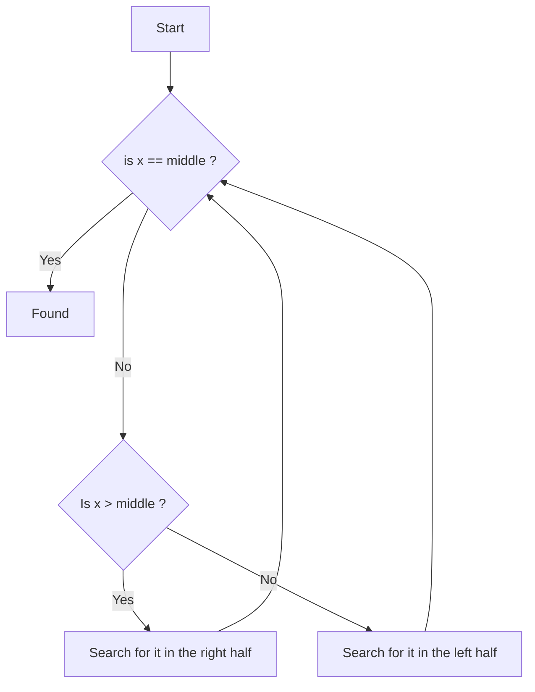

# Space Measure

In order to not deal with *big-O* terms that *hide constants* we use **bits** $n$ and **words** ( fromed by $\Theta(\log n)$ *bits* where $n$ is the size of the input )
# Full-Text indexing

>[!important] Definition
>
>Given a text (string) $T \in \sum^n$ ( text of lengh $n$ over *alphabet* $\sum$ ) , an **Index** is a *data structure* $\mathscr{I}(T)$ that can solve the following *queries* : 
>+ $locate(P)$ : 
>	+ Given $P \in \sum^m$ ( a *pattern* ) return the starting positions in $T$ where $P$ occurs
>	+ $locate(P) = \{i : T[i,i+m-1] = P\}$
>+ $count(P)$ :
>	+ Given $P \in \sum^m$ , return how many times $P$ occurs in $T$ 
>	+ $count(P) = |locate(P)|= occ$
>+ $extract(i,\textit{l})$ : 
>	+ Return $T[i,\dots,i+\textit{l}-1]$ or the text that start at position $i$ and is of lenght $\textit{l}$

>[!example] 
>$T$ = abaab$
>+ count(ab) = 2
>+ locate(ab) = {1,4}
>+ count(a) = 3
>+ locate(a) = {1,3,4}
>+ extract(2,3) = baa
>+ extract(4,2) = ab

## Query times

Consider that 
$occ$ = number of occurences of that pattern $P$ ,
$l$ = lenght of the substring to extact 
$m$ = query lenght

+ $locate(P)$ : $O(m + occ)$ , we must read at least $m$ character of the pattern $P$ and output at least $occ$ , or the *occurancies* of the pattern
+ $count(P)$ : $O(m)$ , we must at least read the pattern
+ $extract(i, \textit{l})$ : $O(\textit{l})$ , the least that we can output is $l$ characters 

## Space 

**IT** lowerbound for the text is :
$$
\log \sum^n = n \log |\sum|
$$
## Streaming

1. $T$ arrives as a stream. Build a *compressed* $\mathscr{I}(T)$ on the fly , never storing $T$  (dynamic compressed indexes)
2. Arrives patterns $P_1,P_2, \dots,P_k$ as a stream. Search on $\mathscr{I}(T)$ on the fly 

# Suffix trie

>[!important] 
>Any *substring* is a *prefix* of a *suffix* 

>[!example] 
>$S = abaab\$$ , $ab$ appears as a prefix of *ab*$aab\$$

>[!info] Idea
>Insert all suffixes of $S$ in a *tree*, solve queries by navigating it from the root

## Building It

Let's build a *tree* for $S= abaab\$$ 

First list all the *suffixes* : 
+ abaab$
+ baab$
+ aab$
+ ab$
+ b$
+ $

Than we build the *tree* in the following way : 

 1. Starting from the smallest *suffix* we create a node for each different starting letter with the starting position of that *suffix* as a number inside the *leaf*  
![[suffixtrie_1st.excalidraw.png|346]]
%%[[suffixtrie_1st.excalidraw.md|🖋 Edit in Excalidraw]]%%

>[!note] 
>The nodes on each level ( at each childer ) needs to be ordered *alphabetically*

2. Add new nodes by starting from common *prefixes* 
![[suffix_trie_full.excalidraw.png]]
%%[[suffix_trie_full.excalidraw.md|🖋 Edit in Excalidraw]]%%

3. For each *leaf* node we add a **pointer** to the next *leaf* 
![[suffitree_withpoint.excalidraw.png]]
%%[[suffitree_withpoint.excalidraw.md|🖋 Edit in Excalidraw]]%%

4. Every node stores a *pointer* to it's *leftmost* and *rightmost* *leaf* below it

![[suffixtree_leftright_point_lefsn.excalidraw.png]]
%%[[suffixtree_leftright_point_lefsn.excalidraw.md|🖋 Edit in Excalidraw]]%%

## Queries

+ *count(P)* : simply walks the path of the pattern and return the number stored in the node where we stop 
Complexity : $O(m)$ , since we simply walk the pattern

+ *locate(P)* : walk the path of the pattern than follow the *leftmost* pointer and jump following the *leaf* pointers until you reach it's corresponding *rightmost* pointer
Complexity : $O(m +occ)$ , since we walk the pattern and than we count its occurancies
>[!note] 
>The numbers on the *leaf* in this case are the starting position of the patter $P$ in the text $T$

>[!example] 
>#todo

+ *extract(i,l)* : ???

## Space complexity

This data structure , for a string of length $n$ it takes $O(n^2)$ *words* 
# Optimized Suffix Trie ( Suffix Tree )

We can optimize *unitary* paths by just storing 2 numbers : $[\text{starting index}, \text{end index}]$

>[!example] 
>*aab$* , in $T=abaab\$$ is stored as $[3,6]$

The tree becomes the following : 
![[suffix_tree.excalidraw.png]]
%%[[suffix_tree.excalidraw.md|🖋 Edit in Excalidraw]]%%
## Queries

>[!note] 
>We need a small space to remember the number mappings to letters

+ *count(P)* : We walk the pattern in the tree , as before if we stop at a node we return the number present in that node , otherwise if the patterns end in the middle of a path we go down to the first node and return that number
Complexity $O(m)$

+ *locate(P)* : We do as before walk the path of the pattern than follow the *leftmost* pointer and jump following the *leaf* pointers until you reach it's corresponding *rightmost* pointer , if the pattern stops in the middle of the path than we just move to the next node
Complexity $O(m +occ)$

## Space Complexity

In this case the space is $O(n)$ 

Since we have $n$ suffixes ( one per leaf ) and every internal node has *at least* $2$ childern we have that the total number of nodes is : 
$$
I+L \ge 2I \implies L \ge I
$$
Sobstituting $L=n$ we have : 
$$
I \le n
$$
Than the total number of nodes is $I+L = n + n = 2n \approx O(n)$ 
# Suffix Array

Let's create a table table that associates *suffixes* **sorted** *lexicographically* with they'r leaf number : 

If we read from root to leaf , from left to right we obtain the *suffixes* ordered lexicographically

| suffix | leaf number |
| ------ | :---------: |
| $      |      6      |
| aab$   |      3      |
| ab$    |      4      |
| abaab$ |      1      |
| b$     |      5      |
| baab$  |      2      |
The array of integers is called *Suffix Array* ( **SA** )

Now just given the *text* and the **SA** we can solve *count* and *locate* efficently
## Query

>[!note] 
> We can use *binary search*

+ *count(P)* : First we jump in the middle of the **SA** and start comparing the text with the pattern $P$ if it's larger search on the right otherwise on the left , we repeat recursively until we find the range that starts with our interval , than will be the indexes to count
+ *locate(P)* : Same as *count* but the indexes remaining are the starting indexes of the pattern 