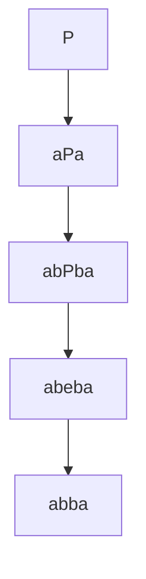

# Context free grammar

A **CFG** is a set of rules explaining how nonterminal symbols are expanded into a composition of other nonterminal symbols and terminal symbols 

They are called **context free** because a non terminal symbol has no sorrounding contex, it can always be replaced 

Example : _describing palindromes_

With the alphabet { _a_, _b_ } :

$P \longrightarrow \varepsilon | aPa | bPb | a | b$

means : **P** can be expanded in either the empty string $\varepsilon$ or _a**P**a_ or _b**P**b_ or _a_ or _b_

where :
+ $\varepsilon$ is the empty string
+ | means or
+ $\varepsilon$ , _a_ and _b_ are **terminal** symbols ( they do not expand )
+ **P** is a **non terminal** symbol ( something that expands, generally capitalized )

_a**P**a_ means :  _a_ concatenated with **P** concatenated with _a_

Example : derive _abba_



If there are multiple rules , the strings are derived from the first rule

Example : 
$P \longrightarrow \varepsilon | aA | bB | a | b$
$A \longrightarrow Pa$
$B \longrightarrow Pb$

## Balanced Parentheses Sequences (BPS)

We can rapresent a sequence of pharentheses with **trees**

Example : 

6<font color=1db100> nodes</font> connected by 5<font color=0d7cbd> edges</font>

![[Immagine 2023-04-11 173225.png]]

We can rapresent a sequence of parenthesis visiting recursevly the tree

![[Immagine 2023-04-11 174700.png]]

```pseudocode
visit(u)
	if(u)== NIL: return
	print (
	visit(u.left)
	visit(u.right)
	print )

visit(root)
```


### Compute the height of a tree

The **height of a tree** is the number of edges in its longhest root-to-leaf path

Steps : 
+ come up with a **CFG** for a well-formed **BPS**
+ turn the **CFG** into C++ code for parsing a **BPS**
+ compute the tree height

**CFG**

$T \longrightarrow (S)$ 
$S \longrightarrow \varepsilon | TS$ 

+ _T_ is a tree, _S_ is a seqence of trees ( each internal node can have multiple leaves )

Two recursive functions that extract parentheses from `std::cin` and return the height of the parsed tree
`int T()` , `int S()`

T only eats parentheses , S is needed to read the next parenthesis , to understand if the tree sequence is empty or not

```c++
int T(){ // T->( S )
	char c;
	std::cin>>c; // (
	int h=S();   // S
	std::cin>>c; // )
	return h+1;
}
```

```c++
int S(){ // S -> eps | TS
	char c = std::cin.peek() 
	if (c=='('){ // S -> TS
		int h1 = T();
		int h2 = S();
		return std::max<int> (h1, h2); // height in nodes
	} // S -> eps
	return 0;
}
```

```c++
int main(){
	std::cout<<"insert BPS";
	int h = T() - 1; // edges = nodes - 1
	std::cout<<"height"<<h;
}
```


## Arithmetic trees

+ **arithmetic operators** in the internal nodes
+ **double** for each leaf

### Binary aithmetic trees

An internal node has at most 2 children

**CFG**
$E \longrightarrow (double)|(+EE)|(*EE)$

where :
+ $E$ is an expression
+ $double$ only unsigned double numbers

```c++
double E(){
	char c;
	std::cin>>c; // read (
	std::cin>>c; // read a digit, + , or *
	double res = 0.0;
	if(c>='0' and c<='9'){ // digit
		std::cin.putback(c); //putback int read continue reading a double
		std::cin >> res;
	}else{
		if(c=='+'){
			res = E() + E();
		}else if (c=='*'){
			res = E() * E();
		}
	}
	std::cin>>c; // read )
	return res;
}
```

### Arithmetic trees

Arithmetic tree with fanout $\ge$ 2

**CFG**
+ $E \longrightarrow (double)|(+ES)|(*ES)$
+ $S \longrightarrow E|ES$

where :
+ $double$ only unsigned double numbers
+ $E$ is an expression
+ $S$ is a sequence of expressions

```c++
double E(){
	char c;
	std::cin>>c; // read (
	std::cin>>c; // read a digit, + , or *
	double res = 0.0;
	if(c>='0' and c<='9'){ // digit
		std::cin.putback(c); //putback int read continue reading a double
		std::cin >> res;
	}else{
		if(c=='+'){
			res = E() + S('+');
		}else if (c=='*'){
			res = E() * S('*');
		}
	}
	std::cin>>c; // read )
	return res;
}
```

```c++
double S(char op) {
	double res E();
	char c = E()
	std::cin>>c; // either ( or )
	std::cin.putback(c);
	if(c=='('){ // E is followed by S
		if(op=='+'){
			res+=S('+');
		}else{
			assert(op=='*');
			res*=S('*');
		}
	} // else, E is not followed by S
	return res;
}
```