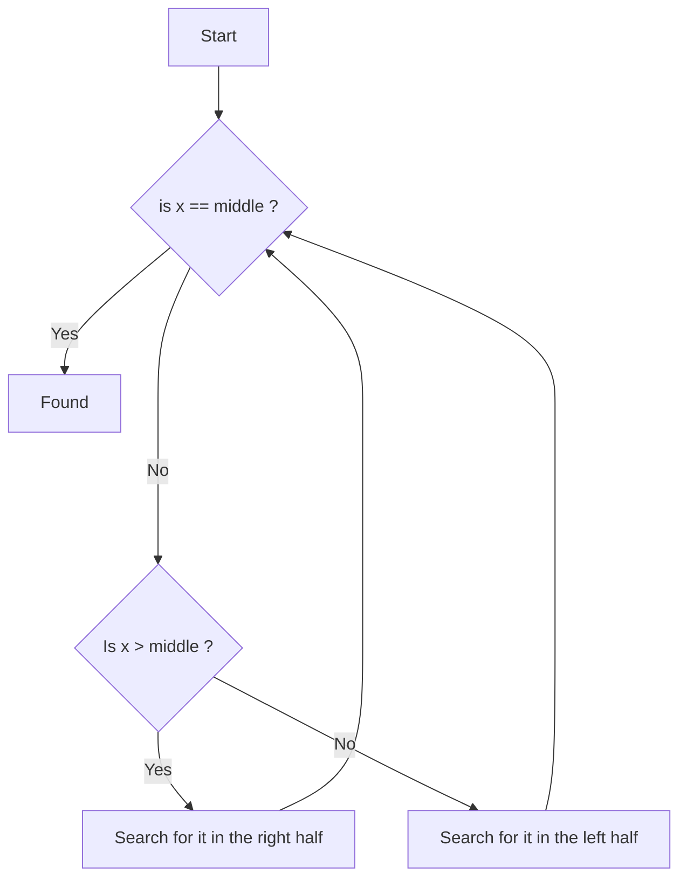

Programming technique in which the function calls itself on a smaller istance of the original problem

3 ingredients to solve recursive problems :
+ **Define a recursive case** : Describe the problem as a composition of smaller sub-problems, each sub-problem is an istance of the original problem but on a smaller input, The function will then call itself on each sub-problem
+ **Define the base case** : The base case is when the recursion should stop, or the problem size for which the solution is known
+ **Combine the solutions** to the sub-problems to solve the original problem

Example : _Climbing a ladder_

To climb a ladder with _n_ steps you climb a step and than you have to climb the next _n-1_ steps

```c++
#include <iostream>
#include <cassert>

int climb_ladder(int n){
	assert(n>=0);
	if(n==0) return 0; //base case
	return 1+climb_ladder(n-1); //recursive case
}

int main(){
	climb_ladder(5);
	return 0;
}
```


Step by step execution :

![[Immagine 2023-04-09 173018.png]]


Example : _Power_

Create a function `int power(int x, int y)` that computes $x^y$ for any y$\ge$ 0

+ y is the problem size
+ y=0 is the **base case** and $x^0$=1 
+ **sub-problem** $x^y$=$x\cdot x^{y-1}$   for every y$\ge$ 1
+ multiplication is the operation to combine the solutions

```c++
int power(int x, int y){
	assert(y>=0);
	if(y==0) return 1; //base case
	return x*power(x, y-1); //recursive case
}
```


Example : _Palindrome string_

Given a string _S_ determine if _S_ is a palindrome or not ( empty string is a palindrome )

+ _n_ = length of _S_ is the problem size
+ **base case** if an empty or single-character string ( _n_$\leq$ 1 )
+ **sub-problem** _S_ is palindrome if and only if _S(0)_ and _S(n-1)_ are equal and _S(1...n-2)_ is palindrome

```c++
bool is_palindrome(std::string const& S, int i, int j){
	if(i>=j) return true; //base case
	if(S[i]!=S[j]) return false;
	return is_palindrome(S, i+1, j-1); //recursive case
}
```


Example : _Factorial function_

Compute the facotrial function : $n!=n\cdot(n-1)\cdot(n-2)\cdot ... \cdot2\cdot1$ == $n!=n\cdot(n-1)!$       ( with n $\ge$ 0 )

+ **base case** : 0!=1

```c++
uint64_t factorial(const uint64_t n){
	if(n==0) return 1; //base case
	return n*factorial(n-1); //recursive case
}
```


Step by step execution :

![[Immagine 2023-04-09 180650.png]]


Example : _Binomial coefficents_

Compute the binomial coefficient where :
$$\binom{n}{k} = \frac{n!}{k!(n-k)!}= \frac{n(n-1)!}{k(k-1)!(n-k)!}=\frac{x}{k}\binom{n-1}{k-1}=$$
$$=\frac{x}{k}\binom{n-1}{k-1}=(1+\frac{n-k}{k})\cdot \binom{n-1}{k-1}= \binom{n-1}{k-1}+ \frac{n-k}{k}\cdot \frac{(n-1)!}{(k-1)!(n-k)!}=$$
$$= \binom{n-1}{k-1}+\binom{n-1}{k}$$
This will be the recursive formula with $0 \leq k \leq n$

```c++
uint64_t binomial_coefficient(const uint64_t n, const uint64_t k){
	assert(n>=k);
	if(k==0 or k==n) return 1; //base case
	return binomial_coefficent(n-1, k-1) + binomial_coefficent(n-1, k); //recursive case
}
```


Example :  _Fibonacci numbers_

+ **base case** : $F(0) = 0$ and $F(1) = 1$
+ **recursive function** : $F(n) = F(n-2) + F(n-1)$  if $n\ge2$ 

```c++
uint64_t fibonacci(const uint64_t n){
	if(n==0) return 0; //base case
	if(n==1) return 1; //base case
	return fibonacci(n-2) + fibonacci(n-1); //recursive case
}
```


Step by step execution : 

![[Immagine 2023-04-09 185115.png]]


Example : _Find all words_

We are given an alphabeth of _n_ symbols, we have to generate all words of length _k_ 
There are in total $n^k$ words

+ _k_ is the problem size
+ **base case** is for _k_ = 1
+ **sub-problem** : $n\cdot n^{k-1}$ 

V1 :

```c++
using namespace std;

void generate_all_words_v1(vector<char> const& alphabet, string prefix, const uint54_t k){

	if(prefix.lenght()==k){
		cout<<prefix<<endl;
		return;
	}

	for(auto c : alphabet) generate_all_words_v1(alphabet, prefix + c, k);
}
int main(){
...
string prefix(""); //start with an empty string
...}
```

In this code we have 3 copies : 2 to concatenate ( copy prefix and c ) and one to pass the concatenated string to the function 

V2 :

```c++
using namespace std;

void generate_all_words_v2(vector<char> const& alphabet, string& prefix, const uint54_t k){

	if(prefix.lenght()==k){
		cout<<prefix<<endl;
		return;
	}

	for(auto c : alphabet){
		prefix.push_back(c);
		generate_all_words_v2(alphabet, prefix + c, k);
		prefix.pop_back();
	} 
}

int main(){
...
string prefix("");
string.reserve(k); //reserve space for k characters
...}
```

push_back and pop_back may decide to reallocate the reserved space in order not to waste unnecessary space

V3 : 

```c++
void generate_all_words_v3(vector<char> const& alphabet,int i, string& word){

	if(i==word.length()){
		cout<<word<<endl;
		return;
	}

	for(auto c : alphabet){
		word[i]=c;
		generate_all_words_v3(alphabet, i+1, word);
	} 
}

int main(){
...
string word;
word.resize(k);
...}
```


Example : _Count the number of inversions in an array_

.............................................................................


## Binary search

Determines if a key _x_ is present in a **sorted** array _v_

**Principle** :



**Code**

```c++
// Return the position of x into vector v if x is found -1 other wise

int binary_search_helper(std::vector<int> const& v, int lo, int hi, int x){
	if(lo > hi) return -1; //base case : nothing found
	int mid=(lo+hi)/2;
	int val= v[mid];

	if(val==x) return mid; //base case
	if(val<x) return binary_search_helper(v, mid+1, hi, x); // search right part
	return binary_search_helper(v. lo, mid-1, x); // search left part
}

int binary_search(std::vector<int> const& v, int x){
	binary_search_helper(v, 0, v.size()-1, x );
}
```

